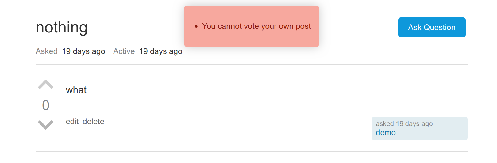

# NullPointerException
NullPointerException is a Q&A web application tailored towards software developers based off of [Stack Overflow](http://stackoverflow.com/).
Main features include asking question, answer questions, improving each other's posts, and voting.

## Live Demo
https://npe-app.herokuapp.com/

## Technologies
- Ruby on Rails
- React
- Redux
- PostgreSQL
- Webpack

## Features
### User Auth
- Signup

- Login
- Login as demo

### Ask Question


### Answer Question


### Edit Posts

- Can edit own post
- Can edit other people's post
- Editing is actually creating a new revision rather then overwriting the original one


### Vote on Posts


## Features that might have gone unnoticed
### Voting when not logged in


When you click on vote buttons while before logging in, stack overflow will shows you a modal. This behavior is replicated in this app too.

### Voting on your own post


It doesn't make sense for user to vote on their own post. So it will shows a nice popup telling users that they can't do that.

```javascript
export const Popup = ({ children, showUntil = () => true, timeOut = 3000, style = "danger" }) => {

  const [show, setShow] = useState(true);

  const dispatch = useDispatch();

  useEffect(() => {
    setShow(true);
    const timer = setTimeout(() => {
      setShow(false);
      dispatch(clearPostError());
    }, timeOut);
    return () => {
      clearTimeout(timer);
      dispatch(clearPostError());
    }
  }, [children]);

  return show ? <div className={ `alert ${ style } popup` }>
    { children }
  </div> : null;
}
```
And the popup is a reusable component. (Also used in Signup and Login)

### Owner indicator


You will notice that some signature has a blue background. That is a special signature indicating that user is the person who asked the question.

### Time tooltips


When hovering over the Asked or Active span, you can see the excact time of the action.

### Input validation


The input box will turn red if the input is not valid.

### Loading indicators


Beside that big orange spinning thing when the page is loading, buttons also have their own spinning indicator.
Also, when you click the button, it will disable the whole from, preventing a duplicate submission.

## Random Stuff

### What is up with the name `NullPointerException`?
`StackOverflow` is a common runtime error in programs, and `NullPointerException` is even more prominent.
It happens when the program try to access some properties of null objects.
The name `NullPointerException` is specific to JVM languages, and it is similar to
`TypeError: Cannot read property 'foo' of undefined` in JavaScript or
`NoMethodError: undefined method 'foo' for nil:NilClass` in ruby. 
